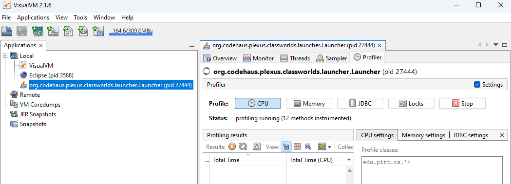
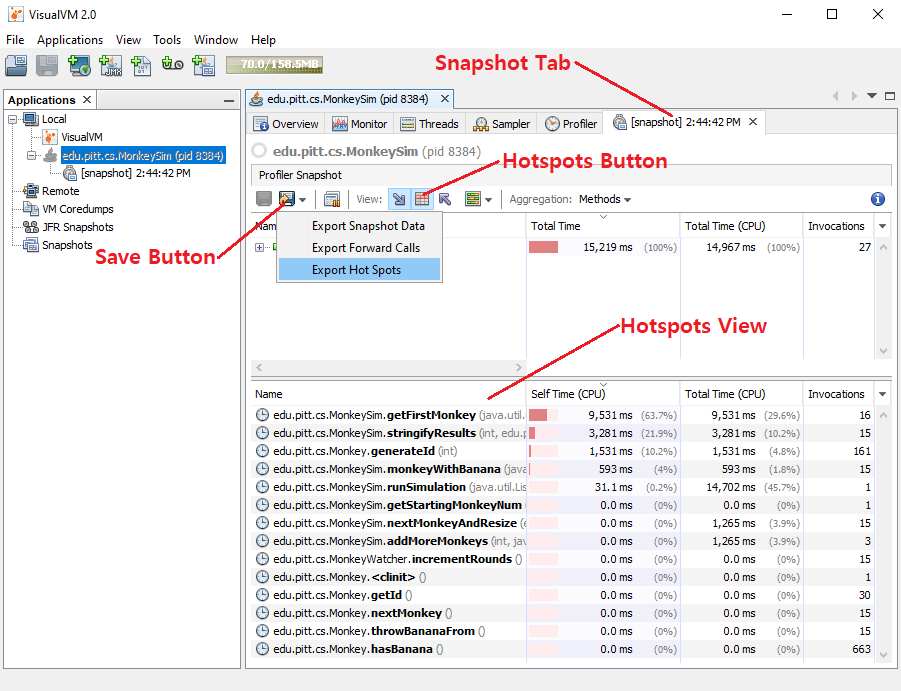
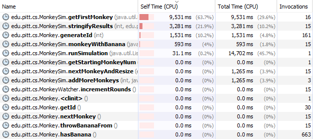
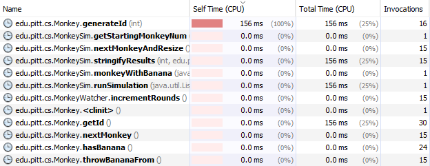

- [Introduction](#introduction)
- [Prerequisites](#prerequisites)
- [Monkey Simulation Details](#monkey-simulation-details)
- [How to Run MonkeySim](#how-to-run-monkeysim)
- [Task 1: Profile to Find Candidate Methods](#task-1-profile-to-find-candidate-methods)
- [Task 2: Refactor Candidate Methods](#task-2-refactor-candidate-methods)
- [Task 3: Run Pinning Tests for Candidate Methods](#task-3-run-pinning-tests-for-candidate-methods)
- [Task 4: Rerun Profile for Refactored Methods](#task-4-rerun-profile-for-refactored-methods)
- [Resources](#resources)

# Introduction

Let's say you are day 1 in your job in a software organization and you are
given a project named "Monkey Simulation" to performance test and optimize.
There is almost no documentation on the software and the engineer who wrote the
code has left the organization, like is the case with many pieces of legacy
code.  Where do you start?

As we learned in class, the first thing you should start with is
Service-Oriented Testing to measure QoS (Quality of Service) and see if it
falls short of user expectations.  Let's say a response time requirement of the
software is that on average each round of simulation in "Monkey Simulation"
shall take less than 100 milliseconds on the target machine.  The
[sample_runs.txt](sample_runs.txt) file shows some sample runs you did on the
software passing various command line arguments, while measuring response time
using the Linux `time` utility.  The results show that the response time
clearly exceeds 100 ms per round, as shown by `real` time (which as we learned
is what shows user experienced wall clock time).

The results of `time` gives us some Efficiency-Oriented Testing metrics as well
in the form of `user' time and `sys` time.  The fact that `user` time dominates
`real` time hint at what the performance problem is: algorithms or data
structures used in the software that is making inefficient use of compute
resources.  What now?  Maybe you can start eyeballing the code to guess where
the program is wasting a lot of compute time.  But what if your code base is
millions of lines long?  Talk about finding a needle in a haystack.  We will
learn to use a technique called profiling that takes all the guesswork out of
the picture.

Profiling is a form of dynamic program analysis where data is collected
during runtime of a program, usually for the purposes of performance
optimization.  The data is typically collected through some form of
instrumentation on the program code, where extra instructions are inserted
specifically for the purposes of monitoring the program while it runs and
collecting data.  For Java, this instrumentation happens at the bytecode
level.  For example, if the profiler wanted to measure how long a method
takes to execute, it may do instrumentation similar to the following:

```
void foo() {
  ___instrumentMethodBegin("foo");
  // body of foo()
  ___instrumentMethodEnd("foo");
}

void ___instrumentMethodBegin(String method) {
  beginTime = ___getTime();
}

void ___instrumentMethodEnd(String method) {
  endTime = ___getTime();
  duration = endTime - beginTime;
  ___addToMethodRunningTime(method, duration);
}
```

Performance debugging through profiling is an iterative process.  On each
iteration, you will do the following:

1. Profile the program.  Sort all methods in descending order of CPU utilization and
   search for refactoring opportunities starting from the top.
1. Refactor selected method to be more performant (being careful not to change functionality using pinning tests).
1. Profile again to determine whether you made enough improvement, otherwise go back to 1.

In this way, on each iteration, you will be able to focus on the method that
has the most potential for improvement.  It is important to profile at the
beginning of each iteration to get the most up-to-date profile since the
last refactoring may have had non-local effects (impacted the performance of
other methods besides the method refactored).

# Prerequisites

Let's start by downloading the VisualVM Java profiler from:
https://visualvm.github.io/

Please click on the download link at the top of the project page.  Keep the
download running as you read the below instructions and install it when it is
ready.  The install package is just a ZIP file that you can decompress at a
location of your choice.  Under it, there is a **bin/** directory and within it
are the application binaries.  Try launching the app and if it does not run
properly, please read the troubleshooting guide on the download webpage.  One
common problem is that it complains that there is no compatible JDK found at
launch.  Then, you may have to pass the **--jdkhome "\<path to JDK\>"**
argument as instructed in the webpage, or more preferably, edit the
**etc/visualvm.conf** file found in the installation to uncomment the line, if
you don't want to pass that argument every time:

```
#visualvm_jdkhome=<path to JDK>
```

and replace the \<path to JDK\> with your actual path.  In my machine, the correct setting was:

```
visualvm_jdkhome="C:\Program Files\Eclipse Adoptium\jdk-11.0.21.9-hotspot"
```

# Monkey Simulation Details

You will be relying on pinning tests to ensure you do not change the functional
behavior of the software, and treating this as legacy software with no
documentation and no requirements specification either.  Even the pinning tests
were written by observing existing behavior of the software, without any
knowledge of requirements.  So the requirements of this software is irrelevant
to the application of task at hand.  However, for the intellectually curious, ,
MonkeySim is a simulation of a mathematical theory called the Collatz
Conjecture (https://en.wikipedia.org/wiki/Collatz_conjecture).  In summary,
given the following rules:

* There are infinite monkeys numbered #1, #2, #3, etc., and one banana.

* One of the monkeys is in possession of the banana initially.

* The monkey who has the banana shall throw it to another monkey during each round.

* If a monkey is even-numbered (e.g., monkey #2, monkey #4, etc.), then the
  monkey with the banana shall throw the banana to the monkey equal to one-half
of that initial monkey's number `(n / 2)`.  For example, monkey #4 shall throw
the banana to monkey #2, and monkey #20 shall throw the banana to monkey #10.

* If a monkey is odd-numbered (and not monkey #1), the monkey with the banana
  shall throw it to the monkey equal to three times the number of that monkey
plus one `(3n + 1)`.  For example, monkey #5 shall throw the banana to monkey
#16 `((3 * 5) + 1)`.

* If Monkey #1 receives the banana, the game terminates.

The conjecture is that no matter which monkey initially has the banana, Monkey
#1 will eventually catch the banana in a finite amount of time.  Nobody has
been able to find an initial monkey which behaves otherwise, but nobody has
been able to prove that such a monkey does not exist either (which is why it is
called a conjecture)!

The above functionality is already working in the legacy software and the
behavior is pinned down using a set of pinning tests in
**MonkeySimPinningTest.java**.  All you need to do for the exercise is to run
the test suite every time you refactor the code to make sure you didn't break
any existing functionality.  Considerations when writing the pinning tests are
detailed in the pinning test section below.

# How to Run MonkeySim

Let's first invoke the Maven test-compile phase to generate class files for
both the main and test source code folders:

```
mvn test-compile
```

Then you can execute MonkeySim using the exec-maven-plugin included in the
pom.xml file, passing 4 as an argument in this example, or passing as argument
any other desired starting monkey number:

```
mvn exec:java "-Dexec.args=4"
```

# Task 1: Profile to Find Candidate Methods

In order to determine the "hot spots" of the application, you will need to run
a profiler such as VisualVM.  Using the profiler, determine a method you can
modify to measurably increase the speed of the application without modifying
behavior.

Please run the below commandline for profiling purposes.

```
mvn exec:java "-Dexec.args=23"
```

I will demonstrate how to profile in class, but if you need a refresher here
are two helpful guides:

Overview of VisualVM: https://docs.oracle.com/javase/8/docs/technotes/guides/visualvm/applications_local.html

Guide to using Profiling: https://docs.oracle.com/javase/8/docs/technotes/guides/visualvm/profiler.html

Follow these steps in order to attach VisualVM to your running application.
Yes, you first have to run your application before you can attach VisualVM.

1. No matter how quick you are in attaching VisualVM, you will have missed a
   few seconds of program execution in the beginning.  To capture the entirety
of execution please insert a 30 second sleep() at the beginning of the main()
method:

   ```
   try {
      Thread.sleep(30000);
   } catch (InterruptedException iex) {
   }
   ```

   If you are able to attach VisualVM within the 30 seconds, all methods
would be instrumeted with time measuring instructions by the time the
program resumes.

1. After inserting the sleep, launch the app using the given commandline.

   ```
   mvn exec:java "-Dexec.args=23"
   ```

1. When the org.codehaus.plexus.classworlds.launcher.Launcher app shows up on
the left panel, double click on it, or right click on it then click "Open" in
the context menu, to open the app for profiling.

1. Then click on the "Profiler" tab to open the Profiler window.

1. Then in the "Profile classes:" box under "CPU settings", replace the
contents with the following string:

   ```
   edu.pitt.cs.**
   ```

   This will direct VisualVM to only profile classes that matches the above
pattern (the \*\* is a wild card), and not other classes (such as classes
inside the maven-exec-plugin).

1. Then click on the "CPU" button to start profiling CPU usage.  Once you click
on the button, you should see the status message "profiling running (12 methods
instrumented)" below the button.  You need to perform all these steps within
the 30 second sleep window given above.  If you need more time, just extend the
sleep window.  If all goes well, your VisualVM window should look like below:

   


1. After the app wakes up, you will see profile information continue to get
collected as the program is running.  Snapshots allow you to freeze the profile
at a certain point of time so that you can analyze it later.  You can also save
a snapshot to a file for later analysis.  Please review the below guide:

   https://docs.oracle.com/javase/8/docs/technotes/guides/visualvm/snapshots.html

   VisualVM automatically asks whether to take a snapshot at the end of program
execution.  In our case, we want to profile the entire run, so we will wait
until the end to generate a snapshot.

After opening the snapshot tab, click on the "Hot spots" button to get a list
of hot spot methods.  Make sure the "Hot spots" view lists the methods sorted
in descending order of running time (Self Time).  Now let's try saving the hot
spots list to a file.  You can export by clicking on the down arrow beside the
save button (that looks like a floppy disk) to pull down the menu and then
clicking on "Export Hotspots".  You are given an option between CSV, HTML, XML,
and PNG.  Choose the PNG option and save to a file named
**hotspots-before.png**.  Refer to the below figure while following these
instructions.



The exported hotspots-before.png file should look like the following:



The exact runtimes will be different for you since we are running on different
machines but the ranking should look similar.  I want you to refactor **four** of
the most time consuming methods in MonkeySim, looking at the profile.

Now, given a method such as getFirstMonkey, you may want to know in
which context that method was called before starting optimization.  If you
right click on one of the methods in the "Hot spots" methods list, you'll get a
context menu.  If you click on a the "Find in Forward Calls" item, you can see
the call tree that got you to that method.

# Task 2: Refactor Candidate Methods

Now you are ready to modify the candidate method.  Remember, the program should
work EXACTLY the same as before, except it should be faster and take up less
CPU time.  

When refactoring the four methods, you should not change the behavior of any of
the methods; only refactor the implementation so that they are more efficient.
Three of the methods will be very straightforward because they contain
obviously redundant computation.

One method (generateId) is less straightforward.  All the computation seems
necessary to generate the monkey IDs that are displayed in the output.  Naively
removing the ID generation will result in a different output.  Hint: Do we
really need to generate all those IDs for the output?

Make sure that all the pinning tests pass after you are done.

# Task 3: Run Pinning Tests for Candidate Methods

You can run the pinning tests in the file **MonkeySimPinningTest.java** as part
of the Maven test lifecycle phase as before:

```
mvn test
```

Make sure they pass with output like the following:

```
...
-------------------------------------------------------
 T E S T S
-------------------------------------------------------
Running edu.pitt.cs.MonkeySimPinningTest
Tests run: 5, Failures: 0, Errors: 0, Skipped: 0, Time elapsed: 5.755 sec

Results :

Tests run: 5, Failures: 0, Errors: 0, Skipped: 0

[INFO] ------------------------------------------------------------------------
[INFO] BUILD SUCCESS
[INFO] ------------------------------------------------------------------------
...
```

The tests pass with the original MonkeySim, obviously because the pinning tests
were based on the observed behavior of MonkeySim to begin with.  Your job is to
make sure that they stay that way while refactoring.

For your exercise, I will ask **you** to write pinning tests yourself.  And for
these pinning tests, I'm going to ask you to write unit tests for those pinning
tests (unlike the integration tests shown here).

# Task 4: Rerun Profile for Refactored Methods

Now that you are done optimizing, rerun the profile again with the same
argument and see if you made a satisfactory difference:

```
java -cp target/classes edu.pitt.cs.MonkeySim 23
```

Repeat the steps described above to generate a new hot spots list named
**hotspots-after.png**. This is what I got after optimizing:



Note that I achieved marked improvement for all four candidate methods.  You
should see similar improvements.  Now, if you try measuring the response time
for various command line arguments, you will see that it is well within the
required QoS requirement of 100 ms / round.  This is when you pat yourself on
the back and declare victory.

# Resources

* VisualVM Download:  
https://visualvm.github.io/download.html

* VisualVM Documentation:  
https://visualvm.github.io/documentation.html

Method profiling is not the only thing that VisualVM knows how to do.  It can
also profile overall CPU usage, heap memory usage, thread creation/termination,
class loading/unloading, Java just-in-time compiler activity, etc.  It can also
profile heap memory in a detailed way to show which types of objects are
filling the memory and where their allocation sites were.  
